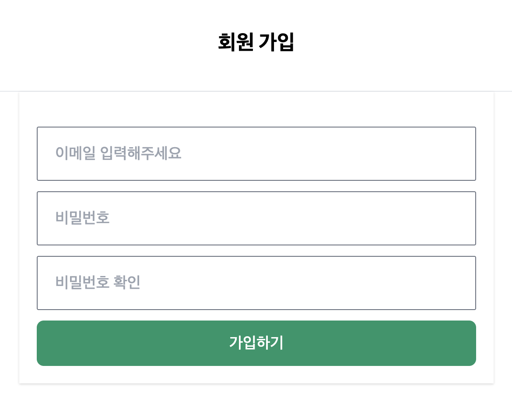

### Spring Boot Admin & User Authentication Template

#### 빠른 스프링 부트 프로젝트 생성을 위해 만든, Spring Security를 통한 사용자 관리 템플릿

#

#### 스프링 부트 프로젝트 생성 편의를 위하여 어드민, 유저 인증 과정을 미리 세팅해 놓은 템플릿입니다.

> [victolee93님 템플렛 참조했습니다.](https://github.com/victolee93/Springboot-signup-login)

#

#### 다음과 같은 기본 기능을 가지고 있습니다.

```
- 모두가 접근 가능한 메인 페이지
- 로그인, 로그아웃, 회원 가입
- 유저 프로필 조회, 정보 수정
- ADMIN만 접속 가능한 어드민 페이지
```





#

### 어드민/회원 생성 방법

#### test/com.victorlee/signuplogin/service/MemberServiceTest.어드민추가() 테스트 실행!

> email을 admin@example.com으로 설정한 유저는 어드민이 됩니다.

```
@Test
    @Transactional
    @Rollback(false)
    public void 어드민추가 () {
        MemberDto member = new MemberDto(0L, "admin@example.com", "admin");
        Long memberId = memberService.joinUser(member);
    }
```
